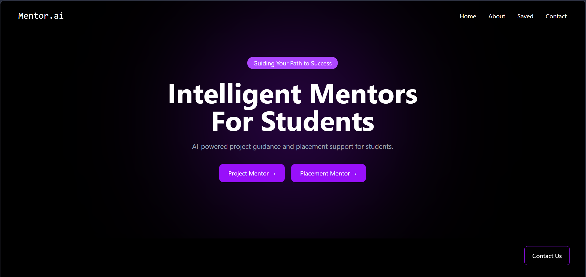
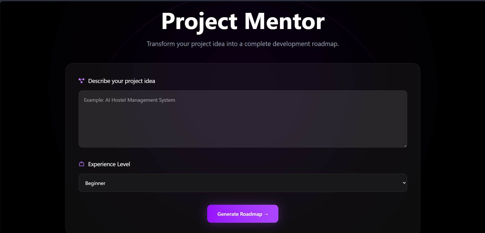
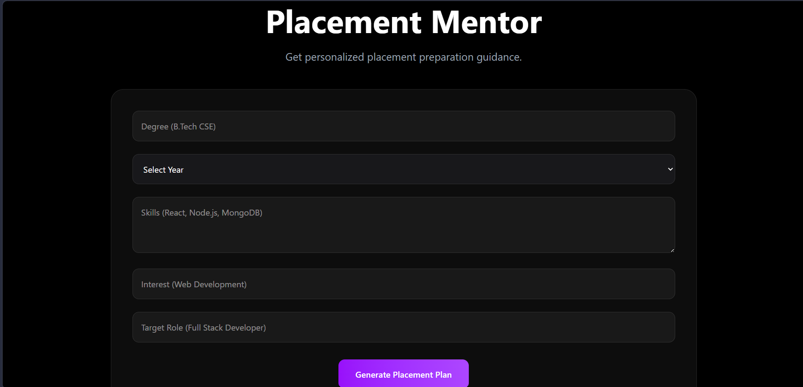
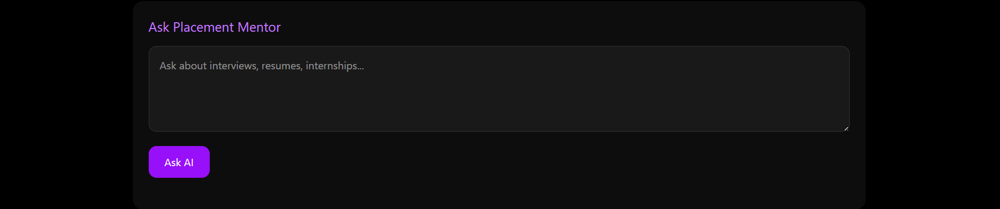

# Mentor.ai

AI-Powered Career & Project Guidance Platform for Students

---

## Overview

Mentor.ai is an AI-powered platform that helps students plan projects, prepare for placements, identify skill gaps, and receive personalized career guidance through real-time AI interactions.

The platform combines Large Language Models (Gemini and Groq) with a modern web interface to provide actionable recommendations for project development and career growth.

---

## Features

### Project Mentor

Generate a complete project development roadmap from an idea.

Includes:

* Project Overview
* Recommended Tech Stack
* Architecture Suggestions
* Database Design
* API Recommendations
* Development Roadmap
* Deployment Guide
* AI Project Chat Assistant

### Placement Mentor

Provides personalized placement guidance.

Includes:

* Career Readiness Score
* Recommended Job Roles
* Skill Gap Analysis
* Learning Roadmap
* Recommended Projects
* Interview Preparation Topics
* Internship Strategy
* Learning Resources
* AI Placement Chat Assistant

### AI-Powered Conversations

Students can ask follow-up questions about:

* Technologies
* Architecture
* Project Development
* Career Planning
* Interview Preparation
* Skill Improvement
* Internship Strategies

---

## Tech Stack

### Frontend

* React.js
* React Router
* Tailwind CSS
* React Icons

### Backend

* FastAPI
* Python

### AI Services

* Google Gemini 2.5 Flash
* Groq (Llama 3.3 70B Fallback)

### Deployment

* Frontend: Vercel
* Backend: Render

---

## Live Demo

Frontend:

YOUR_VERCEL_LINK

---

## GitHub Repository

YOUR_GITHUB_LINK

---

## System Architecture

```text
User
 │
 ▼
React Frontend
 │
 ▼
FastAPI Backend
 │
 ├────────► Gemini API
 │
 └────────► Groq API (Fallback)
                │
                ▼
          AI Response
                │
                ▼
        Frontend Display
```

---

## Data Flow

```text
User Input
    │
    ▼
Frontend Form
    │
    ▼
FastAPI Endpoint
    │
    ▼
Prompt Generation
    │
    ▼
Gemini / Groq
    │
    ▼
Structured Response
    │
    ▼
Frontend Rendering
```

---

## Project Structure

```text
project-and-placement/

├── frontend/
│   ├── src/
│   ├── public/
│   └── package.json
│
├── backend/
│   ├── routes/
│   ├── services/
│   ├── models/
│   └── main.py
│
├── screenshots/
│
└── README.md
```

---

## Screenshots

### Home Page



### Project Mentor



### Placement Mentor



### AI Chat Assistant



---

## Installation

### Clone Repository

```bash
git clone YOUR_GITHUB_LINK
```

### Frontend Setup

```bash
cd frontend

npm install

npm run dev
```

Frontend runs on:

```text
http://localhost:5173
```

### Backend Setup

```bash
cd backend

python -m venv venv

venv\Scripts\activate

pip install -r requirements.txt
```

Create a `.env` file:

```env
GEMINI_API_KEY=your_key

GROQ_API_KEY=your_key
```

Run the backend:

```bash
python -m uvicorn main:app --reload
```

Backend runs on:

```text
http://127.0.0.1:8000
```

---

## API Endpoints

### Project Mentor

```http
POST /api/project/generate
```

```http
POST /api/project/ask
```

### Placement Mentor

```http
POST /api/placement/generate
```

```http
POST /api/placement/ask
```

---

## Challenges Faced

* Handling Gemini API quota limitations
* Parsing structured JSON responses from LLMs
* Maintaining consistent AI output formats
* Implementing Groq fallback support
* Designing reusable prompts for multiple use cases

---

## Future Improvements

* Resume Analyzer
* ATS Score Checker
* Mock Interview Simulator
* Resume Builder
* Job Recommendation System
* User Authentication
* Progress Tracking Dashboard
* Saved Roadmaps and Career Plans

---

## Learning Outcomes

This project helped me gain experience in:

* Prompt Engineering
* FastAPI Development
* React Development
* REST API Design
* LLM Integration
* Error Handling
* AI Product Development
* Full Stack Application Architecture

---

## Author

Sreemsun Anand

B.Tech Student

Submitted as part of the QuAnHack AI Workflow Challenge.
